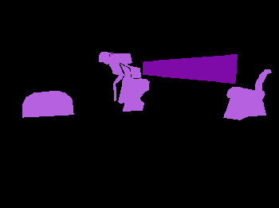
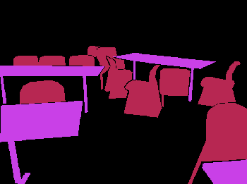

# OVERVIEW
This repository contains 2 toy examples for the usage of the MonteScene library:  
- PolygonGame1  
- PolygonGame2  
  
Both examples use MonteScene to select a subset of proposals from a set of input proposals to best match a ground truth.  
The input proposals are polygons with labels related to scene.  
The differ in how the ground truth is provided.




(The colors in the gif are randomly chosen in each frame, but there are always to groups: chairs and tables.)

## PolygonGame1
In this example the ground truth is provided in the same format as the proposals: As labeled polygons.
## PolygonGame2
In this example the polygons are rendered to what is essentially a semantic segmentation. And this is provided as the input for the code.


# DIRECTORY STRUCTURE
- .vscode/: Visual Studio Code launch configuration
- input/: The input data for running either example
	- image.jpg
	- truth.json
	- proposals.json
- PolygonGame1/
	- output/: The output of running example 1
	- settings.yaml: The settings for running example 1
- PolygonGame2/
	- output/: The output of running example 2
	- settings.yaml: The settings for running example 2
- requirements.txt: for installing the required dependencies
- (Matching/: depended upon by examples)
- (Proposals/: depended upon by examples)


# DEPENDENCIES
These dependencies need to be installed in whatever python environment you are using:  
## Python Version
Works with python 3.8.10
## MonteScene
The MonteScene library.  
You can find the library and the installation instructions in this github repository:  
[MonteScene](https://github.com/vevenom/MonteScene)
## Remaining Dependencies
These are other dependencies for these specific examples.  
They are provided in the requirements.txt file.  


# INPUT
The examples need the following input files (provided in the input folder):  
- image.jpg: The original image.  
- truth.json: The intended output (is in these examples directly provided to keep it simple).  
- proposals.json: The individual proposals from which the output will be constructed (in these examples simply a superset of truth.json).  
## Labelme on Ubuntu
The json input data was created by labeling objects in labelme.  
On Ubuntu labelme can be installed with:  
```console
[sudo] apt install labelme
```


# RUN
## -m
The examples need to be run as a module (with the -m option).  
```console
python3 -m <example folder: PolygonGameX>
```
## VSCode: launch.json
The repository contains a .vscode folder with a launch configuration for Visual Studio Code.  
## Settings
In each example folder there is a settings.yaml file that lets you specify the configuration for running that example.


# OUTPUT
These examples output tensorboard logs.  
## output directory
The log files are stored in the folder PolygonGameX/output/  
## tensorboard
To view the most recent logfile use the command:  
```console
tensorboard --logdir <output directory>
```
and open the url specified in the output of the command.  
### show all images
Tensorboard does not by default show all logged images. To specify how many image to display, you can run the command with the samples_per_plugin option:  
```console
tensorboard --logdir <output directory> --samples_per_plugin images=<number of images to show (e.g. 100000)>
```